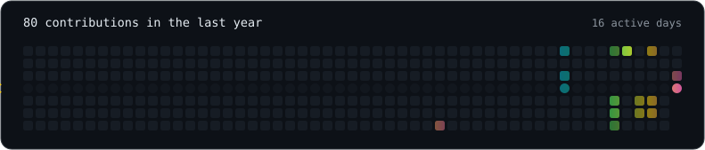

  <picture>
    <source media="(prefers-color-scheme: dark)" srcset="assets/card-dark.svg">
    <source media="(prefers-color-scheme: light)" srcset="assets/card-light.svg">
    
  </picture>

  <picture>
    <source media="(prefers-color-scheme: dark)" srcset="assets/typing-dark.svg">
    <source media="(prefers-color-scheme: light)" srcset="assets/typing-light.svg">
    
  </picture>

  Full-stack developer from Ukraine. 
  On the front — React and Next.js, with GSAP and Three.js when a page has to move. 
  On the back — Node, Next.js API routes, Python and Playwright when something 
  has to go out and fetch data for itself. Desktop when a browser tab is not enough.

  <a href="https://yurii-dmytrenko.vercel.app"><b>Portfolio</b></a> ·
  <a href="https://github.com/YuraItDeveloper14?tab=repositories">All repositories</a>

  <picture>
    <source media="(prefers-color-scheme: dark)" srcset="assets/graph-dark.svg">
    <source media="(prefers-color-scheme: light)" srcset="assets/graph-light.svg">
    
  </picture>

