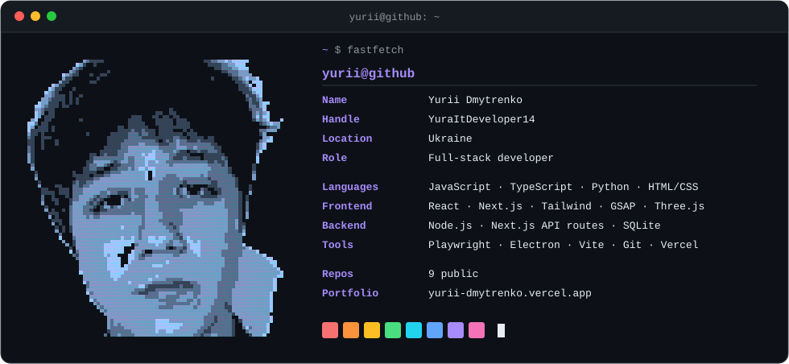

  <picture>
    <source media="(prefers-color-scheme: dark)" srcset="assets/card-dark.svg">
    <source media="(prefers-color-scheme: light)" srcset="assets/card-light.svg">
    
  </picture>

  <picture>
    <source media="(prefers-color-scheme: dark)" srcset="assets/typing-dark.svg">
    <source media="(prefers-color-scheme: light)" srcset="assets/typing-light.svg">
    
  </picture>

  Full-stack developer from Ukraine. 
  On the front — React and Next.js, with GSAP and Three.js when a page has to move. 
  On the back — Node, Next.js API routes, Python and Playwright when something 
  has to go out and fetch data for itself. Desktop when a browser tab is not enough.

<h3 align="center">Work</h3>

  <b><a href="https://github.com/YuraItDeveloper14/sayso">sayso</a></b> — offline push-to-talk voice control for a laptop ·
  <a href="https://yuraitdeveloper14.github.io/sayso/">demo</a> 
  <b><a href="https://github.com/YuraItDeveloper14/Portfolio">Portfolio</a></b> — a 3D globe that flies from space down to Ukraine as you scroll ·
  <a href="https://yurii-dmytrenko.vercel.app">site</a> 
  <b><a href="https://github.com/YuraItDeveloper14/CrownFlower">CrownFlower</a></b> — cap-brand storefront with cart, wishlist and a 3D hero ·
  <a href="https://crownflower.vercel.app">site</a> 
  <b><a href="https://github.com/YuraItDeveloper14/Spinute">Spinute</a></b> — one minute of speaking practice, then an honest breakdown ·
  <a href="https://spinute.vercel.app">app</a> 
  <b><a href="https://github.com/YuraItDeveloper14/Webscrapper">Webscrapper</a></b> — pulls businesses off Google Maps and extracts contact emails ·
  <a href="https://leadgen-0bg6.onrender.com">app</a> 
  <b><a href="https://github.com/YuraItDeveloper14/seasons-scroll">seasons-scroll</a></b> — one courtyard, twelve months, one continuous shot ·
  <a href="https://yuraitdeveloper14.github.io/seasons-scroll/">site</a>

  <a href="https://yurii-dmytrenko.vercel.app"><b>Portfolio</b></a> ·
  <a href="https://github.com/YuraItDeveloper14?tab=repositories">All repositories</a>

